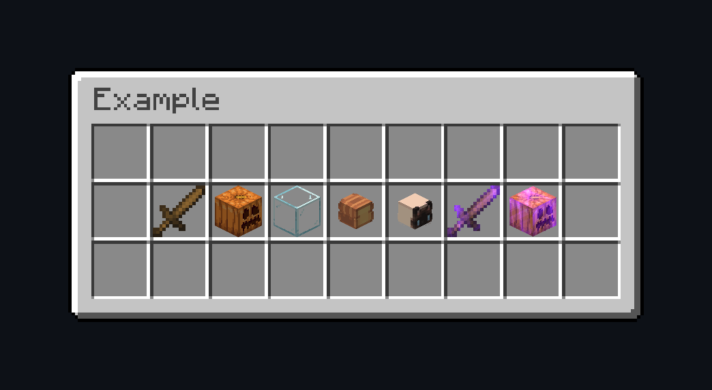

# minecraft-enchantment-render
A Minecraft WebGL renderer with support for enchantments.

[](https://l3g7.github.io/minecraft-enchantment-render/example/)
<br>

## [Example](https://l3g7.github.io/minecraft-enchantment-render/example/) ([src](https://github.com/L3g7/minecraft-enchantment-render/tree/master/example)), [Documentation](https://l3g7.github.io/minecraft-enchantment-render/jsdoc/)

## Usage
```js
import { createRenderer, MODEL_CUBE } from "minecraft-enchantment-render-1.0.0.js";

createRenderer(document.querySelector("#exampleCanvas"), {
    modelType: MODEL_CUBE,
    textureURL: "./glass.png",
});
```
See [JSDoc](https://l3g7.github.io/minecraft-enchantment-render/jsdoc/) for details.

## Common Issues
<details>
<summary>The texture doesn't load when using an absolute URL / <code>DOMException: The operation is insecure</code></summary>
<br>
Loading textures from other servers may get blocked by the browser due to <a href="https://developer.mozilla.org/en-US/docs/Web/HTTP/Guides/CORS">CORS</a>.
Ensure that the right headers are set and that you're using HTTPS.
</details>
